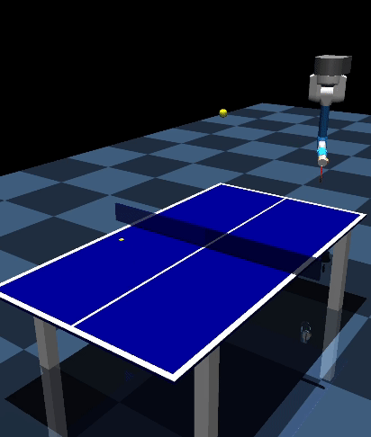

# Mujoco

## Step-Based Environments

### Box Pushing

   

The box-pushing task presents an advanced environment for reinforcement learning (RL) systems, utilizing the versatile Franka Emika Panda robotic arm, which boasts seven degrees of freedom (DoFs). The objective of this task is to precisely manipulate a box to a specified goal location and orientation.

This environment defines its context space with a goal position constrained within a certain range along the x and y axes and a goal orientation that encompasses the full 360-degree range on the z-axis. The robot's mission is to achieve positional accuracy within 5 centimeters and an orientation accuracy within 0.5 radians of the specified goal.

The observation space includes the sine and cosine values of the robotic joint angles, their velocities, and quaternion orientations for the end-effector and the box. The action space describes the applied torques for each joint.

A composite reward function serves as the performance metric for the RL system. It accounts for the distance to the goal, the box's orientation, maintaining a rod within the box, achieving the rod's desired orientation, and includes penalties for joint position and velocity limit violations, as well as an action cost for energy expenditure.

Variations of this environment are available, differing in reward structures and the optionality of randomizing the box's initial position. These variations are purposefully designed to challenge RL algorithms, enhancing their generalization and adaptation capabilities. Temporally sparse environments only provide a reward at the last timestep. Spatially sparse environments only provide a reward, if the goal is almost reached, the box is close enought to the goal and somewhat correctly aligned.

These environments all provide smoothness metrics as part of the return infos:

- mean_squared_jerk: Averages the square of jerk (rate of acceleration change) across the motion. Lower values indicate smoother movement.
- maximum_jerk: Identifies the highest jerk value encountered.
- dimensionless_jerk: Normalizes the summed squared jerk over the motion's duration and peak velocity, offering a scale-independent metric of smoothness

| Name                                       | Description                                                          | Horizon | Action Dimension | Observation Dimension |
| ------------------------------------------ | -------------------------------------------------------------------- | ------- | ---------------- | --------------------- |
| `fancy/BoxPushingDense-v0`                 | Custom Box-pushing task with dense rewards                           | 100     | 3                | 13                    |
| `fancy/BoxPushingTemporalSparse-v0`        | Custom Box-pushing task with temporally sparse rewards               | 100     | 3                | 13                    |
| `fancy/BoxPushingTemporalSpatialSparse-v0` | Custom Box-pushing task with temporally and spatially sparse rewards | 100     | 3                | 13                    |

---

### Table Tennis

   

The table tennis task offers a robotic arm equipped with seven degrees of freedom (DoFs). The task is to respond to incoming balls and return them accurately to a specified goal location on the opponent's side of the table.

The context space for this environment includes the initial ball position, with x-coordinates ranging from -1 to -0.2 meters and y-coordinates from -0.65 to 0.65 meters, and the goal position with x-coordinates between -1.2 to -0.2 meters and y-coordinates from -0.6 to 0.6 meters. The full observation space comprises the sine and cosine values of the joint angles, the joint velocities, and the ball's velocity, providing comprehensive information for the RL system to base its decisions on.

A task is considered successfully completed when the returned ball not only lands on the opponent's side of the table but also within a tight margin of 20 centimeters from the goal location. The reward function is designed to reflect various conditions of play, including whether the ball was hit, if it landed on the table, and the proximity of the ball's landing position to the goal location.

Variations of the table tennis environment are available to cater to different research needs. These variations maintain the foundational challenge of precise ball return while providing additional complexity for RL algorithms to overcome.

| Name                                | Description                                                                                        | Horizon | Action Dimension | Observation Dimension |
| ----------------------------------- | -------------------------------------------------------------------------------------------------- | ------- | ---------------- | --------------------- |
| `fancy/TableTennis2D-v0`            | Table Tennis task with 2D context, based on a custom environment for table tennis                  | 350     | 7                | 19                    |
| `fancy/TableTennis2DReplan-v0`      | Table Tennis task with 2D context and replanning, based on a custom environment for table tennis   | 350     | 7                | 19                    |
| `fancy/TableTennis4D-v0`            | Table Tennis task with 4D context, based on a custom environment for table tennis                  | 350     | 7                | 22                    |
| `fancy/TableTennis4DReplan-v0`      | Table Tennis task with 4D context and replanning, based on a custom environment for table tennis   | 350     | 7                | 22                    |
| `fancy/TableTennisWind-v0`          | Table Tennis task with wind effects, based on a custom environment for table tennis                | 350     | 7                | 19                    |
| `fancy/TableTennisGoalSwitching-v0` | Table Tennis task with goal switching, based on a custom environment for table tennis              | 350     | 7                | 19                    |
| `fancy/TableTennisWindReplan-v0`    | Table Tennis task with wind effects and replanning, based on a custom environment for table tennis | 350     | 7                | 19                    |
| `fancy/TableTennisRndRobot-v0`      | Table Tennis task with random initial robot joint positions \*                                     | 350     | 7                | 19                    |

\* Random initialization of robot joint position and speed can be enabled by providing `random_pos_scale` / `random_vel_scale` to make. `TableTennisRndRobot` is equivalent to `TableTennis4D` except, that `random_pos_scale` is set to 0.1 instead of 0 per default.

---

### Beer Pong

   

<!-- TODO: Vid is ugly and unsuccessful. Replace. -->

The Beer Pong task is based upon a robotic system with seven Degrees of Freedom (DoF), challenging the robot to throw a ball into a cup placed on a large table. The environment's context is established by the cup's location, defined within a range of x-coordinates from -1.42 to 1.42 meters and y-coordinates from -4.05 to -1.25 meters.

The observation space includes the cosine and sine of the robot's joint angles, the angular velocities, and distances of the ball relative to the top and bottom of the cup, along with the cup's position and the current timestep. The action space for the robot is defined by the torques applied to each joint. For episode-based methods, the parameter space is expanded to 15 dimensions, which includes two weights for the basis functions per joint and the duration of the throw, namely the ball release time.

Action penalties are implemented in the form of squared torque sums applied across all joints, penalizing excessive force and encouraging efficient motion. The reward function at each timestep t before the final timestep T penalizes the action penalty, while at t=T, a non-Markovian reward based on the ball's position relative to the cup and the action penalty is considered.

An additional reward component at the final timestep T assesses the chosen ball release time to ensure it falls within a reasonable range. The overall return for an episode is the sum of the rewards at each timestep, the task-specific reward, and the release time reward.

A successful throw in this task is determined by the ball landing in the cup at the episode's conclusion, showcasing the robot's ability to accurately predict and execute the complex motion required for this popular party game.

| Name                            | Description                                                                                    | Horizon | Action Dimension | Observation Dimension |
| ------------------------------- | ---------------------------------------------------------------------------------------------- | ------- | ---------------- | --------------------- |
| `fancy/BeerPong-v0`             | Beer Pong task, based on a custom environment with multiple task variations                    | 300     | 3                | 29                    |
| `fancy/BeerPongStepBased-v0`    | Step-based rewards for the Beer Pong task, based on a custom environment with episodic rewards | 300     | 3                | 29                    |
| `fancy/BeerPongFixedRelease-v0` | Beer Pong with fixed release, based on a custom environment with episodic rewards              | 300     | 3                | 29                    |

---

### Variations of existing environments

| Name                           | Description                                                                                      | Horizon | Action Dimension | Observation Dimension |
| ------------------------------ | ------------------------------------------------------------------------------------------------ | ------- | ---------------- | --------------------- |
| `fancy/Reacher-v0`             | Modified (5 links) gymnasiums's mujoco `Reacher-v2` (2 links)                                    | 200     | 5                | 21                    |
| `fancy/ReacherSparse-v0`       | Same as `fancy/Reacher-v0`, but the distance penalty is only provided in the last time step.     | 200     | 5                | 21                    |
| `fancy/LongReacher-v0`         | Modified (7 links) gymnasiums's mujoco `Reacher-v2` (2 links)                                    | 200     | 7                | 27                    |
| `fancy/LongReacherSparse-v0`   | Same as `fancy/LongReacher-v0`, but the distance penalty is only provided in the last time step. | 200     | 7                | 27                    |
| `fancy/Reacher5d-v0`           | Reacher task with 5 links, based on Gymnasium's `gym.envs.mujoco.ReacherEnv`                     | 200     | 5                | 20                    |
| `fancy/Reacher5dSparse-v0`     | Sparse Reacher task with 5 links, based on Gymnasium's `gym.envs.mujoco.ReacherEnv`              | 200     | 5                | 20                    |
| `fancy/Reacher7d-v0`           | Reacher task with 7 links, based on Gymnasium's `gym.envs.mujoco.ReacherEnv`                     | 200     | 7                | 22                    |
| `fancy/Reacher7dSparse-v0`     | Sparse Reacher task with 7 links, based on Gymnasium's `gym.envs.mujoco.ReacherEnv`              | 200     | 7                | 22                    |
| `fancy/HopperJump-v0`          | Hopper Jump task with continuous rewards, based on Gymnasium's `gym.envs.mujoco.Hopper`          | 250     | 3                | 15 / 16\*             |
| `fancy/HopperJumpMarkov-v0`    | `fancy/HopperJump-v0`, but with an alternative reward that is markovian.                         | 250     | 3                | 15 / 16\*             |
| `fancy/HopperJumpSparse-v0`    | Hopper Jump task with sparse rewards, based on Gymnasium's `gym.envs.mujoco.Hopper`              | 250     | 3                | 15 / 16\*             |
| `fancy/AntJump-v0`             | Ant Jump task, based on Gymnasium's `gym.envs.mujoco.Ant`                                        | 200     | 8                | 119                   |
| `fancy/HalfCheetahJump-v0`     | HalfCheetah Jump task, based on Gymnasium's `gym.envs.mujoco.HalfCheetah`                        | 100     | 6                | 112                   |
| `fancy/HopperJumpOnBox-v0`     | Hopper Jump on Box task, based on Gymnasium's `gym.envs.mujoco.Hopper`                           | 250     | 4                | 16 / 100\*            |
| `fancy/HopperThrow-v0`         | Hopper Throw task, based on Gymnasium's `gym.envs.mujoco.Hopper`                                 | 250     | 3                | 18 / 100\*            |
| `fancy/HopperThrowInBasket-v0` | Hopper Throw in Basket task, based on Gymnasium's `gym.envs.mujoco.Hopper`                       | 250     | 3                | 18 / 100\*            |
| `fancy/Walker2DJump-v0`        | Walker 2D Jump task, based on Gymnasium's `gym.envs.mujoco.Walker2d`                             | 300     | 6                | 18 / 19\*             |

\*Observation dimensions depend on configuration.

<!--
No longer used?
| Name                        | Description                                                                                         | Horizon | Action Dimension | Observation Dimension |
| --------------------------- | --------------------------------------------------------------------------------------------------- | ------- | ---------------- | --------------------- |
| `fancy/BallInACupSimple-v0` | Ball-in-a-cup task where a robot needs to catch a ball attached to a cup at its end-effector.       | 4000    | 3                | wip                   |
| `fancy/BallInACup-v0`       | Ball-in-a-cup task where a robot needs to catch a ball attached to a cup at its end-effector        | 4000    | 7                | wip                   |
| `fancy/BallInACupGoal-v0`   | Similar to `fancy/BallInACupSimple-v0` but the ball needs to be caught at a specified goal position | 4000    | 7                | wip                   |
-->

## MP Environments

Most of these envs also exist as MP-variants. Refer to them using `fancy_DMP/<name>` `fancy_ProMP/<name>` or `fancy_ProDMP/<name>`.
